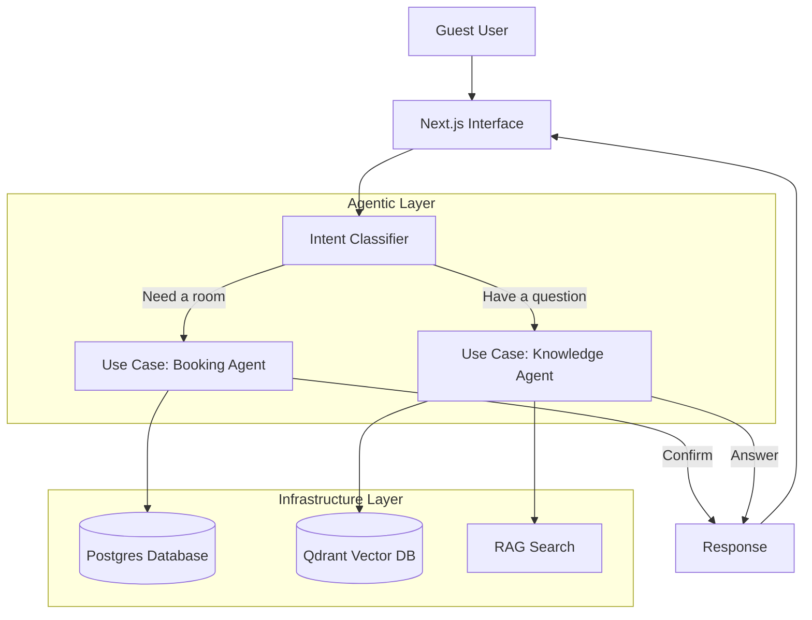

# HotelBot
**Revolutionizing Hospitality with Multi-Agent AI**

[]([LIVE_DEMO_LINK])
[]([LINKEDIN_LINK])
[]([WEBSITE_LINK])
[](mailto:[EMAIL_ADDRESS])

---

## 🧐 The Problem

In the modern hospitality industry, **the guest experience begins long before check-in**. However, many hotels struggle with a critical gap in their digital presence:

1.  **Staffing Bottlenecks:** Front desk staff are overwhelmed by repetitive questions ("Is breakfast included?", "Can I bring my dog?"), leaving less time for high-value guest interactions.
2.  **Missed Revenue:** Booking inquiries that happen after hours or during peak times often go unanswered, resulting in lost direct bookings.
3.  **Static Interfaces:** Traditional booking engines are rigid forms that fail to capture the nuance of a guest's needs ("I need a room with a view for my anniversary"), leading to lower conversion rates.

**The Solution?** An intelligent, 24/7 digital concierge that doesn't just chat—it *acts*.

---

## 💡 The Solution: HotelBot

HotelBot is a sophisticated **Multi-Agent AI System** that transforms how guests interact with hotel services. Unlike simple chatbots that get stuck in loops, HotelBot understands context, retrieves accurate information, and executes complex tasks.

### Key Features & Business Impact

| Feature | Business Value |
| :--- | :--- |
| **🧠 Multi-Agent Orchestration** | **Specialized Competence:** A "Booking Agent" handles reservations while a "Concierge Agent" answers questions. This ensures 100% focus and accuracy for every request. |
| **📚 RAG (Retrieval-Augmented Generation)** | **Trust & Accuracy:** By retrieving answers directly from the hotel's specialized documentation, we eliminate AI hallucinations. Guests get accurate policy info, every time. |
| **🗣️ Natural Language Booking** | **Higher Conversion:** Guests can book simply by saying, *"I need a room for two nights next weekend."* The AI handles the availability, pricing, and confirmation naturally. |
| **🛡️ Clean Architecture** | **Scalability:** Built on enterprise-grade principles, ensuring the system is robust, testable, and ready to scale with the business. |

---

## 🏗️ Technical Architecture

This project demonstrates mastery of modern **Agentic AI** patterns and **Fullstack Engineering**.

### System Design
The system uses a **Router Agent** to classify user intent and delegate tasks to specialized sub-agents.



### Technology Stack

*   **Frontend:** `Next.js 16` (App Router), `TypeScript`, `Tailwind CSS v4`, `Shadcn/ui`
*   **AI Engine:** `Vercel AI SDK 3.3`, `OpenAI GPT-4o`, `Google Gemini`
*   **Data Layer:** `PostgreSQL` (Neon Serverless), `Drizzle ORM`
*   **Vector Search:** `Qdrant` (for high-performance RAG)
*   **Architecture:** Clean Architecture (Domain / Use Cases / Infrastructure separation)

---

## 🚀 Getting Started

Want to see the code in action? Here is how to run the project locally.

### Prerequisites
*   Node.js 20+ & pnpm
*   Docker (optional)
*   API Keys: OpenAI, Google AI, Neon (Postgres), Qdrant

### Installation

1.  **Clone the repository**
    ```bash
    git clone https://github.com/aDataMage/hotelbot.git
    cd hotelbot
    pnpm install
    ```

2.  **Configure Environment**
    ```bash
    cp .env.example .env.local
    # Fill in your API keys in .env.local
    ```

3.  **Initialize Data**
    ```bash
    pnpm db:push        # Push schema to Postgres
    pnpm db:seed        # Seed mock hotel data
    pnpm embed:knowledge # Vectorize hotel policies
    ```

4.  **Run Development Server**
    ```bash
    pnpm dev
    ```

---

## 📬 Contact Me

I specialize in building high-impact, AI-driven applications that solve real business problems. Let's connect!

*   **LinkedIn:** [Your Name]([LINKEDIN_LINK])
*   **Portfolio:** [your-website.com]([WEBSITE_LINK])
*   **Email:** [your-email@example.com](mailto:[EMAIL_ADDRESS])

---
*Built by [Your Name].*
